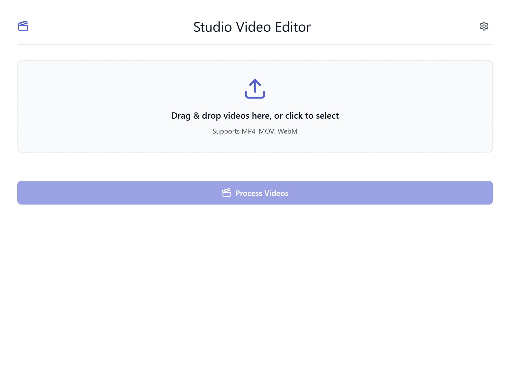
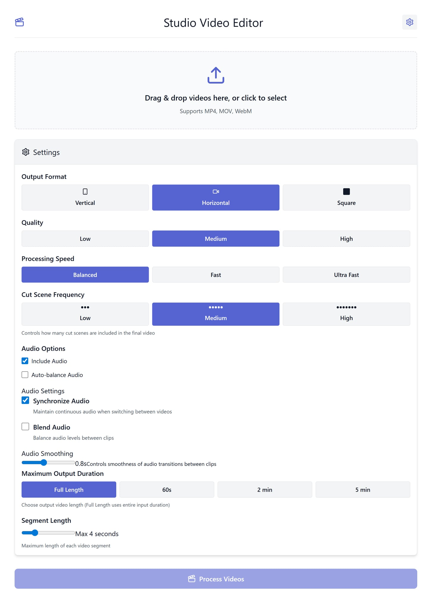
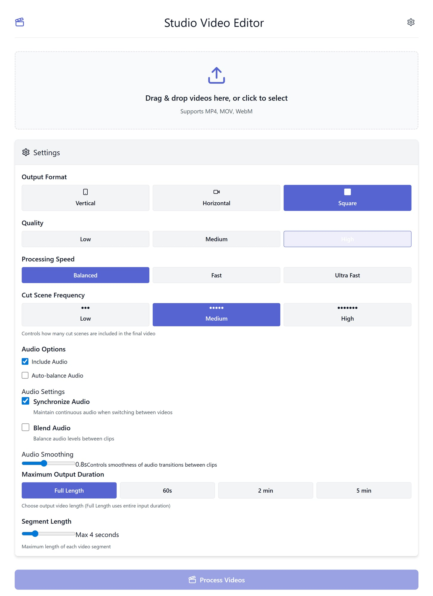

# Studio Video Editor

A modern web-based video editing tool built with React and TypeScript. This application allows users to edit and combine multiple video clips with features like multicam support, audio synchronization, and various transition effects.

## Features

- Multiple video upload support
- Multiple output formats (Vertical, Horizontal, Square)
- Smart scene detection and cutting
- Audio synchronization for multicam editing
- Customizable transitions (Hard cuts or Fades)
- Adjustable processing speed and quality settings
- Advanced audio controls with blending options
- Flexible output duration control
- File validation (format/count/size)
- Processing stage labels + progress telemetry
- Cancel-processing control (safe cancel request)
- One-click presets (Reels / Shorts / TikTok)

## Getting Started

### Prerequisites

- Node.js (recommended: v20+; validated on v24)
- npm or yarn

### Installation

1. Clone the repository:
```bash
git clone [your-repository-url]
cd studio-video-editor
```

2. Install dependencies:
```bash
npm install
```

3. Run test + build checks (recommended before starting dev):
```bash
npm test
npm run test:unit
npm run build
```

4. (Optional) Run e2e smoke in Playwright:
```bash
npm run test:e2e
```

5. Start the development server:
```bash
npm run dev
```

The application will be available at http://localhost:5173

## Usage

1. Upload one or more video files by dragging and dropping them into the upload area
2. Configure your desired output settings:
   - Choose output format (Vertical/Horizontal/Square)
   - Set quality level
   - Adjust processing speed
   - Configure cut scene frequency
   - Enable/disable audio features
3. Click "Process Videos" to start editing
4. Download the processed video when complete

## UI Screenshots (for GitHub)

### Default upload view


### Expanded settings panel


### Settings variants example


## Demo GIF Workflow (for GitHub)
1. Start app: `npm run dev`
2. Record a short interaction (upload area + settings + process click) using:
   - Windows Snipping Tool video, ScreenToGif, or OBS
3. Export as GIF (6-12 seconds recommended)
4. Save to `docs/screenshots/demo-workflow.gif`
5. Embed in README:
```md

```

## Architecture & Performance Notes

- Processing is browser-side using media/canvas APIs plus FFmpeg-web tooling.
- UI now surfaces processing stage telemetry (analyzing/syncing/rendering/finalizing).
- Validation is enforced before processing (format/count/size) to reduce runtime failures.
- Quick presets (Reels/Shorts/TikTok) speed up repeatable output configuration.

## Technology Stack

- React
- TypeScript
- Vite
- Web APIs:
  - MediaRecorder
  - Canvas
  - Web Audio API
  - MediaStream

## License

This project is licensed under the MIT License - see the LICENSE file for details. 

## Team Operations
- Use `docs/DEPLOY_CHECKLIST.md` before release.
- Use `docs/HANDOFF_CHECKLIST.md` for onboarding.
- Deployment runbook: `docs/deployment.md`
- Ops runbook: `docs/ops.md`
- Security notes: `docs/security.md`
- QA gate: `docs/qa-checklist.md`
- Performance baseline: `docs/performance-baseline.md`

## Employment Readiness
This repository includes baseline standards to support hiring and delegation:
- Clear onboarding in README/docs
- CI checks for build/test/lint where applicable
- Handoff/deploy checklist for repeatable operations
- Secret-safe configuration via `.env.example` or platform secrets

## Validation Notes (2026-03-03)
- `npm install` passed
- `npm test` passed (smoke)
- `npm run test:unit` passed
- `npm run test:e2e` passed
- `npm run build` passed
- Build warning observed: `caniuse-lite` outdated (optional maintenance command):
  - `npx update-browserslist-db@latest`

## Final Employment-Ready Snapshot
- Practical feature set with clear UX states (validation, progress, cancel, presets)
- Verified local build + smoke + unit + e2e flow
- Deployment/Ops/Security docs included for handoff quality
- Screenshots included; demo GIF workflow documented (add final GIF after your audio conversion step)

